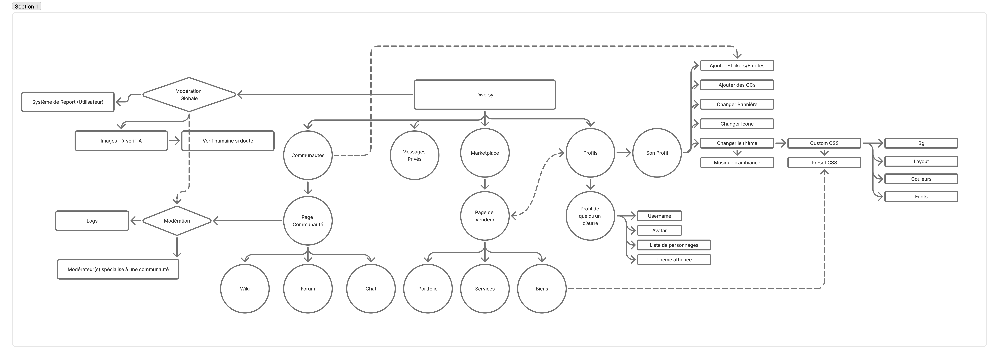

# Diversy

## Why

We present Diversy as a healthy alternative to countless social networks like Discord, Reddit, and Fandom.

Therefore, we want Diversy to be an independent platform that challenges the mindset of large corporations, offering not only a safe space and the most secure environment possible, but above all, a place where you can unleash your creative freedom (within ethical limits).

If you don't want to see much or no AI-generated content, or if the NSFW/SFW line is too blurry for you compared to other platforms, then Diversy is for you. Indeed, we do not advocate the use of generative AI or NSFW content in any way.

## Values

Diversy aims to be a platform that provides:

- Well-being
- Diversity
- Creativity
- Ambition
- As well as security and anonymity

Furthermore, Diversy will be open-source and publicly available on GitHub (But according to rumors, it's going downhill, so I hope an alternative will emerge).

## Feature Map

## Good to know

- Passwordless authentication using email codes
- Sidebar instead of navbar
- Editorjs for WYSIWYG content editing

## Tech Stack

- SvelteKit / Svelte
- External Backend (Hono, Drizzle ORM, SQLite)
